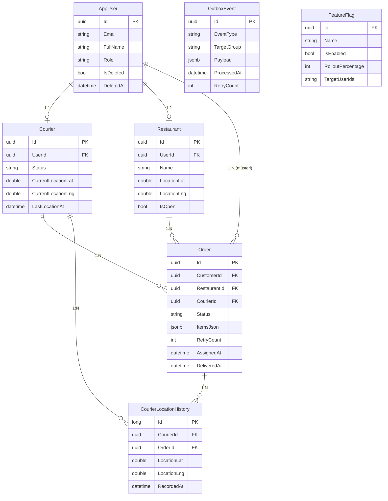

# 🛵 Götür — Sipariş Eşleştirme & Kurye Anlık Takip Sistemi

> VBT Yazılım Staj 2026 · StackShare Replica Projesi  
> Referans sistem: **Getir** (stackshare.io + mühendislik iş ilanları)

[](https://youtube.com/TODO)
[](https://gotur.site)

---

## 📌 Proje Hakkında

Bu proje, Getir'in sipariş eşleştirme ve kurye anlık takip sisteminin MVP klonudur.
Amaç ürünü birebir kopyalamak değil; **gerçek bir sistemin mimari kararlarını okumak, anlamak ve uygulanabilir bir parçaya indirgemek**.

### Çekirdek Akışlar
1. **Sipariş Eşleştirme**: Sipariş gelir → en yakın uygun kurye bulunur (Haversine) → kurye kabul eder → durum makinesi (Pending → ReadyForPickup → Assigned → Picked → Delivered)
2. **Anlık Kurye Takibi**: Kuryenin GPS konumu SignalR ile web ve mobil istemcilere gerçek zamanlı iletilir, Leaflet haritasında gösterilir

---

## 🏗️ Mimari

Detaylı trade-off analizleri için → [ARCHITECTURE.md](./ARCHITECTURE.md)

| Katman | Teknoloji | Getir'de Karşılığı |
|--------|-----------|-------------------|
| Backend | ASP.NET Core 9 Web API | Node.js / Java |
| Veritabanı | PostgreSQL + JSONB | MongoDB |
| Real-time | SignalR (WebSocket) | WebSockets |
| Cache / Lock | Redis | Redis ✓ |
| Background Jobs | Hangfire | RabbitMQ |
| Frontend | React + Vite + Tailwind | React |
| Harita | Leaflet + OpenStreetMap | Google Maps |
| Mobil | Flutter | Kotlin + Swift |
| Tracing | OpenTelemetry → Jaeger/Tempo | — |
| Logging | Serilog + Seq | — |
| Metrics | Prometheus + Grafana | New Relic |

---

## ⚙️ Üretim Kalitesi Özellikler

Bu proje bir demo'nun ötesinde; gerçek sistemlerde karşılaşılan sorunlara çözüm üretilmiştir.

### Tier 1 — Kritik Sistem Güvenilirliği

| Özellik | Nerede | Nasıl Çalışır |
|---------|--------|---------------|
| **Distributed Lock** | `MatchingService` | Redis `SET NX` ile sipariş başına kilit — aynı kuryeye çift atama önlenir |
| **Optimistic Concurrency** | `MatchingService.DoFindAndAssign` | Lock altında `freshCourier.Status == Available` çift kontrol — race condition ikinci katman |
| **Idempotency** | `IdempotencyMiddleware` | `POST /api/orders` — `Idempotency-Key` header ile aynı istek tekrar işlenmez, Redis'te 24sa cache |
| **Outbox Pattern** | `OutboxProcessor` + `OutboxEvent` | DB yazma + SignalR bildirimi aynı transaction — restart sonrası event kaybolmaz |
| **Polly Resilience** | `ResilienceExtensions` | Redis için: Timeout(2s) → CircuitBreaker(30s) → Retry(3x exponential) — Redis down ≠ 500 |
| **OpenTelemetry** | `OpenTelemetryExtensions` | Her isteğe trace-id, EF Core sorgularına kadar taşınır — Jaeger/Tempo ile görselleştirme |

### Tier 2 — Sektör Standardı

| Özellik | Nerede | Nasıl Çalışır |
|---------|--------|---------------|
| **Correlation ID** | `CorrelationIdMiddleware` | Her isteğe `X-Correlation-ID` — tüm log satırlarında taşınır, hata takibi için |
| **Structured Logging** | Serilog + Seq | `CorrelationId`, `UserId`, `OrderId` gibi property'ler ile Seq'te filtreli arama |
| **Rate Limiting** | `RateLimitingExtensions` | 4 politika: auth(10/dk), orders(5/dk), location(20/dk), api(100/dk) — gateway katmanı |
| **Secrets Management** | `SecretsExtensions` | Startup'ta placeholder secret tespiti + JWT uzunluk kontrolü — env variable zinciri |
| **Feature Flags** | `FeatureFlagService` | DB + Redis cache, deterministik %X rollout — `new_matching_algorithm` flag örneği |
| **Chaos Testing** | `docs/CHAOS_TESTING.md` | Redis/DB down senaryoları, graceful degradation kanıtı, race condition testi |

---

## 🚀 Kurulum

### Ön Koşullar
- [.NET 9 SDK](https://dotnet.microsoft.com/download)
- [Node.js 20+](https://nodejs.org/)
- [Docker Desktop](https://www.docker.com/products/docker-desktop/)

### Tek Komutla Başlat (Önerilen)

```bash
# Tüm servisler: PostgreSQL, Redis, API, Frontend
docker compose up -d

# API hazır olunca → http://localhost:5131/swagger
# Frontend          → http://localhost:3000
```

### Sadece Altyapıyı Docker, API'yi Local Çalıştır

```bash
# PostgreSQL + Redis
docker compose up -d postgres redis

# Backend (otomatik migration + seed data)
cd backend/GetirReplica.API
dotnet run
# → http://localhost:5131
# → http://localhost:5131/swagger

# Frontend
cd backend/GetirReplica.API/gotur-web
npm install && npm run dev
# → http://localhost:5173
```

### Gözlemlenebilirlik Stack'ini Ekle

```bash
# Prometheus + Grafana
docker compose -f docker-compose.yml -f docker-compose.monitoring.yml up -d

# Seq (structured log UI)
docker compose -f docker-compose.yml -f docker-compose.logging.yml up -d
```

| Araç | Adres | Giriş |
|------|-------|-------|
| API Swagger | http://localhost:5131/swagger | — |
| Grafana | http://localhost:3001 | admin / gotur-admin |
| Prometheus | http://localhost:9090 | — |
| Seq (Logs) | http://localhost:5341 | — |
| Hangfire | http://localhost:5131/hangfire | — |

---

## 👥 Test Hesapları

| Rol | Email | Şifre |
|-----|-------|-------|
| Müşteri | ahmet.yilmaz@gotur.com | Test123! |
| Kurye (İstanbul) | kurye.istanbul1@gotur.com | Test123! |
| Kurye (Ankara) | kurye.ankara1@gotur.com | Test123! |
| Restoran | karadeniz.mangal@gotur.com | Rest123! |
| Admin | admin@gotur.com | Admin123! |

---

## 🎮 Demo Akışı

### Temel Akış
1. **Müşteri** hesabıyla giriş yap → sipariş ver
2. **Kurye** hesabıyla ayrı sekmede giriş yap → Simülatör başlat (konum göndermeye başlar)
3. **Restoran** hesabıyla → Siparişi "Hazır" işaretle
4. Otomatik eşleştirme gerçekleşir (Kurye'ye `CourierAssigned` bildirimi gelir)
5. **Müşteri** sekmesinde haritada kurye konumunu canlı takip et
6. Kurye panelinden "Aldım" → "Teslim Ettim" geçişi yap
7. Müşteri ekranında 🎉 teslim bildirimi

### Feature Flag Demosu
```bash
# Admin panelinde yeni eşleştirme algoritmasını %10'a aç
curl -X PUT http://localhost:5131/api/admin/feature-flags/new_matching_algorithm \
  -H "Authorization: Bearer <admin_token>" \
  -H "Content-Type: application/json" \
  -d '{"isEnabled": true, "rolloutPercentage": 10}'

# Sonra GET ile kontrol et
curl http://localhost:5131/api/admin/feature-flags \
  -H "Authorization: Bearer <admin_token>"
```

### Chaos / Graceful Degradation Demosu
```bash
# Redis'i kapat — API hâlâ çalışmalı, cache miss → DB'den okur
docker stop gotur-redis
curl http://localhost:5131/api/orders/active -H "Authorization: Bearer <token>"
# Beklenen: 200 (circuit breaker devrede, graceful degradation)

# Logda görmek için
docker logs gotur-api 2>&1 | grep -i "circuit\|cache miss"

# Redis'i geri aç
docker start gotur-redis
```

### Idempotency Demosu
```bash
# Aynı Idempotency-Key ile iki kez istek at
KEY=$(uuidgen)

curl -X POST http://localhost:5131/api/orders \
  -H "Authorization: Bearer <customer_token>" \
  -H "Idempotency-Key: $KEY" \
  -H "Content-Type: application/json" \
  -d '{...}'  # İlk istek — sipariş oluşur

curl -X POST http://localhost:5131/api/orders \
  -H "Authorization: Bearer <customer_token>" \
  -H "Idempotency-Key: $KEY" \
  -H "Content-Type: application/json" \
  -d '{...}'  # İkinci istek — X-Idempotent-Replayed: true header ile aynı response döner
              # DB'ye yazılmaz, duplicate sipariş oluşmaz
```

### Correlation ID Demosu
```bash
# Hata üret — response'da correlationId göreceksin
curl -X GET http://localhost:5131/api/orders/00000000-0000-0000-0000-000000000000 \
  -H "Authorization: Bearer <token>"
# Response: {"status":404,"message":"...","correlationId":"a1b2c3d4..."}

# Seq'te bu ID ile tüm log satırlarını bul: http://localhost:5341
# filter: CorrelationId = 'a1b2c3d4...'
```

Detaylı chaos senaryoları → [docs/CHAOS_TESTING.md](./docs/CHAOS_TESTING.md)

---

## 📁 Proje Yapısı

```
getir-replica/
├── backend/
│   └── GetirReplica.API/
│       ├── Controllers/           # Auth, Orders, Couriers, Admin, Restaurants
│       ├── Services/
│       │   ├── MatchingService    # Distributed lock + Haversine + feature flag
│       │   ├── OrderService       # Outbox pattern + durum makinesi
│       │   ├── LocationService    # Redis cache + rate limit + SignalR
│       │   ├── FeatureFlagService # % rollout + Redis cache
│       │   ├── OutboxProcessor    # Hangfire — SignalR guaranteed delivery
│       │   └── RedisDistributedLockService  # SET NX based locking
│       ├── Middleware/
│       │   ├── CorrelationIdMiddleware  # X-Correlation-ID zinciri
│       │   ├── IdempotencyMiddleware    # Duplicate request koruması
│       │   └── ExceptionMiddleware     # Hata yönetimi + correlationId
│       ├── Extensions/
│       │   ├── OpenTelemetryExtensions  # Dağıtık izleme
│       │   ├── ResilienceExtensions     # Polly pipeline + cache decorator
│       │   ├── RateLimitingExtensions   # 4 politika, gateway katmanı
│       │   └── SecretsExtensions        # Startup secret doğrulama
│       ├── Hubs/                  # SignalR TrackingHub
│       ├── Data/                  # AppDbContext, DataSeeder, Migrations
│       ├── Models/
│       │   ├── Entities/          # Order, Courier, OutboxEvent, FeatureFlag, ...
│       │   ├── DTOs/
│       │   └── Enums/
│       └── gotur-web/             # React + Vite + Tailwind
├── docs/
│   ├── ENGINEERING.md             # Sistem mühendisliği + ölçek
│   └── CHAOS_TESTING.md           # Graceful degradation test senaryoları
├── infra/
│   ├── k8s/                       # Kubernetes manifestleri
│   └── monitoring/                # Prometheus + Grafana provisioning
├── tests/load/                    # k6 yük testleri
├── docker-compose.yml
├── docker-compose.monitoring.yml  # Prometheus + Grafana
├── docker-compose.logging.yml     # Seq (structured logs)
├── ARCHITECTURE.md
└── README.md
```

---

## 🗃️ Veritabanı Şeması



`OrderStatus`: Pending → ReadyForPickup → Assigned → Picked → Delivered / Failed / Cancelled  
`CourierStatus`: Available | Busy | Offline

---

## 📊 Gözlemlenebilirlik

```bash
docker compose -f docker-compose.yml -f docker-compose.monitoring.yml up -d
docker compose -f docker-compose.yml -f docker-compose.logging.yml up -d
```

**Metrikler (Prometheus + Grafana)**
- HTTP throughput, p50/p95/p99 latency, hata oranı
- .NET GC, CPU, memory
- Grafana dashboard otomatik provisioning ile gelir

**Dağıtık İzleme (OpenTelemetry)**
- Her isteğe trace-id — EF Core sorguları dahil
- OTLP → Jaeger veya Grafana Tempo
- `MatchingService.FindAndAssign` özel span'i

**Structured Logging (Serilog + Seq)**
- Her log satırında `CorrelationId`, `UserId`, request path
- Seq'te filtreli arama: `CorrelationId = 'abc123'`

---

## 🔑 Teknik Özellikler Özeti

- **Race Condition Koruması**: Redis distributed lock + PostgreSQL optimistic concurrency
- **Guaranteed Delivery**: Outbox pattern — DB yazma + SignalR bildirimi atomik
- **Graceful Degradation**: Polly circuit breaker — Redis down ≠ uygulama down
- **Duplicate Request Koruması**: Idempotency middleware — mobil network kesintilerinde güvenli
- **Kademeli Özellik Yayınımı**: Feature flags — %X rollout, belirli kullanıcılara açma
- **Gözlemlenebilirlik**: Metrics + Distributed Tracing + Structured Logging üçlüsü
- **Durum Makinesi**: `AllowedTransitions` dictionary — geçersiz geçişler 422 döner
- **Eşleştirme**: Haversine, stale konum filtresi, 3 retry, dağıtık kilit
- **Rate Limiting**: 4 seviyeli politika — gateway pattern, mikroservise taşıma hazır
- **Secrets**: Env variable zinciri, startup doğrulama, K8s Secret pattern

---

## 🐞 Chaos Testing

5 senaryo ile graceful degradation kanıtlanmıştır:

| Senaryo | Beklenen Davranış |
|---------|-------------------|
| Redis down | Cache miss → DB fallback, API çalışmaya devam |
| PostgreSQL down | 503 health, açıklayıcı hata mesajı |
| API restart + Outbox | Event'ler DB'de bekler, restart sonrası işlenir |
| Paralel eşleştirme (race) | Çift atama yok, distributed lock devrede |
| Rate limit aşımı | 429 + Retry-After header |

Detaylar → [docs/CHAOS_TESTING.md](./docs/CHAOS_TESTING.md)

---

## 🧪 Yük Testleri

```bash
# Smoke test
k6 run tests/load/smoke.js

# Sabit yük (50 VU, 5 dakika)
k6 run tests/load/load.js

# 1 milyon iterasyon
k6 run tests/load/million.js
```

Eşikler: p95 < 500ms, p99 < 1000ms, hata oranı < %1

Detaylar → [tests/load/README.md](./tests/load/README.md)

---

## ☸️ Kubernetes

```bash
kubectl apply -k infra/k8s/
```

- Rolling update (zero-downtime)
- HPA: 3–20 API pod (CPU %70 eşiği)
- Resource limits, readiness/liveness probe
- PodDisruptionBudget

Detaylar → [infra/k8s/README.md](./infra/k8s/README.md)

---

## 👨‍💻 Ekip

| İsim | Rol |
|------|-----|
| Çağatay | Backend · Web Frontend · Mimari |
| [Arkadaşın Adı] | Mobil (Flutter) |

---

*VBT Yazılım A.Ş. · Staj 2026*
