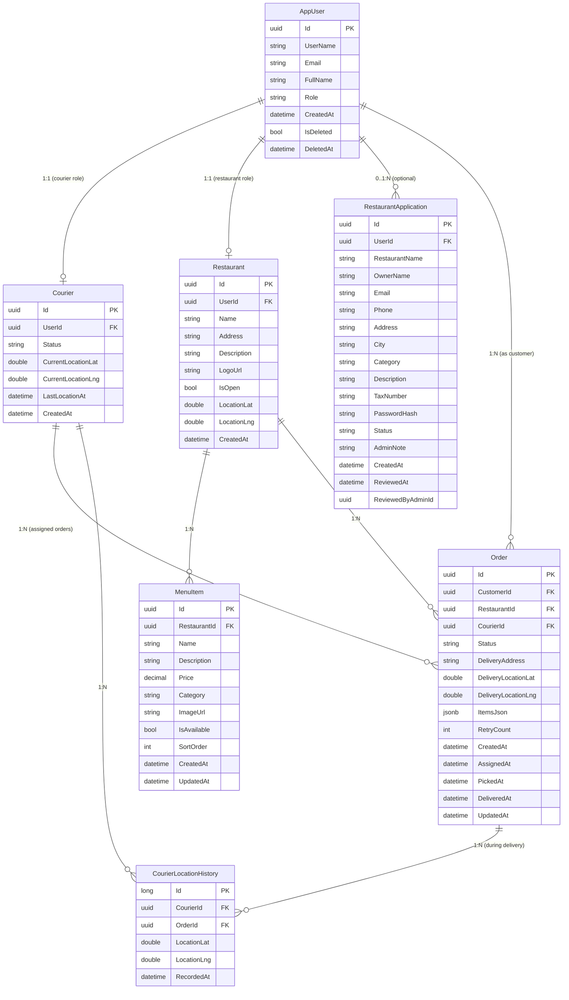

# 🛵 Götür — Sipariş Eşleştirme & Kurye Anlık Takip Sistemi

> VBT Yazılım Staj 2026 · StackShare Replica Projesi  
> Referans sistem: **Getir** (stackshare.io + mühendislik iş ilanları)

[](https://youtube.com/TODO)

---

## 📌 Proje Hakkında

Bu proje, Getir'in sipariş eşleştirme ve kurye anlık takip sisteminin MVP klonudur.  
Amaç ürünü birebir kopyalamak değil; **gerçek bir sistemin mimari kararlarını okumak, anlamak ve uygulanabilir bir parçaya indirgemek**.

### Çekirdek Akışlar
1. **Sipariş Eşleştirme**: Sipariş gelir → en yakın uygun kurye bulunur (Haversine) → kurye kabul eder → durum makinesi (Pending → Assigned → Picked → Delivered)
2. **Anlık Kurye Takibi**: Kuryenin GPS konumu SignalR ile web ve mobil istemcilere gerçek zamanlı iletilir, Leaflet haritasında gösterilir

---

## 🏗️ Mimari

Detaylı trade-off analizleri için → [ARCHITECTURE.md](./ARCHITECTURE.md)

| Katman | Teknoloji | Getir'de Karşılığı |
|--------|-----------|-------------------|
| Backend | ASP.NET Core 9 Web API (API v1 / SemVer 1.0.0) | Node.js / Java |
| Veritabanı | PostgreSQL + JSONB | MongoDB |
| Real-time | SignalR (WebSocket) | WebSockets |
| Cache | Redis | Redis ✓ |
| Background Jobs | Hangfire | RabbitMQ |
| Frontend | React + Vite + Tailwind | React |
| Harita | Leaflet + OpenStreetMap | Google Maps |
| Mobil | Flutter | Kotlin + Swift |

---

## 🚀 Kurulum

### Ön Koşullar
- [.NET 9 SDK](https://dotnet.microsoft.com/download)
- [Node.js 20+](https://nodejs.org/)
- [Docker Desktop](https://www.docker.com/products/docker-desktop/)

### 1. Veritabanı & Redis (Docker)

```bash
# Mevcut bir PostgreSQL varsa getir_replica DB'si oluştur
docker exec <postgres-container> psql -U postgres -c "CREATE DATABASE getir_replica;"

# Ya da docker-compose ile tümünü başlat
docker-compose up -d postgres redis
```

### 2. Backend

```bash
cd backend/GetirReplica.API

# appsettings.json içindeki connection string'i güncelle
# Default: Host=localhost;Port=5433;Database=getir_replica;Username=postgres;Password=123456

dotnet run
# → http://localhost:5131
# → http://localhost:5131/swagger
# Seed data otomatik yüklenir (admin, müşteri, restoran, 2 kurye)
```

### 3. Frontend

```bash
cd backend/GetirReplica.API/gotur-web

npm install
npm run dev
# → http://localhost:5173
```

---

## 👥 Test Hesapları

| Rol | Email | Şifre |
|-----|-------|-------|
| Müşteri | ahmet.yilmaz@gotur.com | Test123! |
| Kurye 1 | kurye.istanbul1@gotur.com | Test123! |
| Kurye 2 | kurye.ankara1@gotur.com | Test123! |
| Restoran | karadeniz.mangal@gotur.com | Rest123! |
| Admin | admin@gotur.com | Admin123! |

---

## 🎮 Demo Akışı

1. **Müşteri** hesabıyla giriş yap → sipariş ver
2. **Kurye** hesabıyla ayrı bir sekmede giriş yap → 🎮 Simülatör başlat
3. Birkaç saniye bekle → eşleştirme otomatik gerçekleşir
4. **Müşteri** sekmesinde haritada kurye konumunu canlı takip et
5. Kurye panelinden "Siparişi Teslim Aldım" → "Müşteriye Teslim Ettim"
6. Müşteri ekranında 🎉 teslim bildirimi

---

## 📁 Proje Yapısı

```
getir-replica/
├── backend/
│   └── GetirReplica.API/          # ASP.NET Core 9 Web API
│       ├── Controllers/           # Auth, Orders, Couriers, Admin, Restaurants
│       ├── Services/              # OrderService, LocationService, MatchingService, TokenService
│       ├── Hubs/                  # SignalR TrackingHub
│       ├── Data/                  # AppDbContext, DataSeeder, Migrations
│       ├── Models/                # Entities, DTOs, Enums
│       └── gotur-web/             # React + Vite + Tailwind frontend
│           └── src/
│               ├── pages/         # LoginPage, CustomerPage, TrackingPage, AdminPage, ...
│               ├── components/    # Navbar, MapView
│               ├── hooks/         # useSignalR
│               └── services/      # api, authService, orderService
├── ARCHITECTURE.md                # Mimari kararlar & trade-off analizi
└── README.md
```

---

## 🗃️ Veritabanı ER Diyagramı



> **Notlar:**
> - `Order.ItemsJson` → JSONB kolonunda sipariş kalemleri (ürün adı, adet, fiyat snapshot) saklanır
> - `CourierStatus`: `Available` | `Busy` | `Offline`
> - `OrderStatus`: `Pending` → `ReadyForPickup` → `Assigned` → `Picked` → `Delivered` / `Failed` / `Cancelled`
> - `ApplicationStatus`: `Pending` | `Approved` | `Rejected`
> - `Courier.CurrentLocation*` ve `Restaurant.Location*` ileride PostGIS `geography(Point, 4326)` tipine taşınacak

---

## 📊 Gözlemlenebilirlik (Prometheus + Grafana)

```bash
# API + monitoring stack'ini birlikte başlat
docker compose -f docker-compose.yml -f docker-compose.monitoring.yml up -d
```

| Araç | Adres | Giriş |
|------|-------|-------|
| Grafana Dashboard | http://localhost:3001 | admin / gotur-admin |
| Prometheus | http://localhost:9090 | — |
| API Metrics | http://localhost:5131/metrics | — |

"Gotur API — Gözlemlenebilirlik" dashboard'ı otomatik yüklü gelir:
HTTP throughput, p50/p95/p99 latency, hata oranı, .NET CPU/memory.

Detaylar → [infra/monitoring/README.md](./infra/monitoring/README.md)

---

## 🔑 Öne Çıkan Teknik Özellikler

- **Gözlemlenebilirlik**: prometheus-net ile `/metrics` endpoint'i; Prometheus scrape + Grafana dashboard (p50/p95/p99 latency, throughput, hata oranı, .NET CPU/GC) otomatik provisioning ile
- **Durum Makinesi**: Sipariş geçişleri `AllowedTransitions` dictionary ile kontrol edilir, geçersiz geçişler 422 döner
- **Eşleştirme Algoritması**: Haversine formülü ile 10km yarıçap, 5 dakika stale konum filtresi, 3 deneme retry (Hangfire)
- **SignalR Grupları**: Her sipariş için `order:{id}` grubu, kuryeler için `courier:{id}` grubu
- **Redis Rate Limit**: Kurye konumu 3sn'de bir kabul edilir, aşımı 429 döner
- **Redis Cache**: Kurye anlık konumu 30sn TTL ile önbellekte, SignalR backplane
- **Test Otomasyonu**: k6 ile smoke, sabit yük ve toplam 1.000.000 login profili; p95/p99 ve hata oranı eşikleri
- **Sistem Mühendisliği**: CI build/type-check, Docker image doğrulama, health/readiness probe ve sürüm endpoint'i
- **Kubernetes**: Rolling update, 3–20 API pod HPA, resource limit, readiness/liveness ve PodDisruptionBudget
- **Analitik / Gözlemlenebilirlik**: k6 JSON sonuçları, structured log ve Prometheus/Grafana için tanımlı ölçüm planı

Detaylı ölçek senaryosu, Redis kavramları, pipeline ve deployment yaklaşımı:
[Sistem Mühendisliği, Ölçek ve Operasyon](./docs/ENGINEERING.md)

Çalıştırılabilir dosyalar:

- [k6 login yük testleri](./tests/load/README.md)
- [Kubernetes deployment manifestleri](./infra/k8s/README.md)

---

## 📹 Demo Video

> YouTube linki eklenecek  
> [Buraya ekle](https://youtube.com/TODO)

---

## 👨‍💻 Ekip

| İsim | Rol |
|------|-----|
| Çağatay | Backend · Web Frontend · Mimari |
| [Arkadaşın Adı] | Mobil (Flutter) |

---

*VBT Yazılım A.Ş. · Staj 2026*
