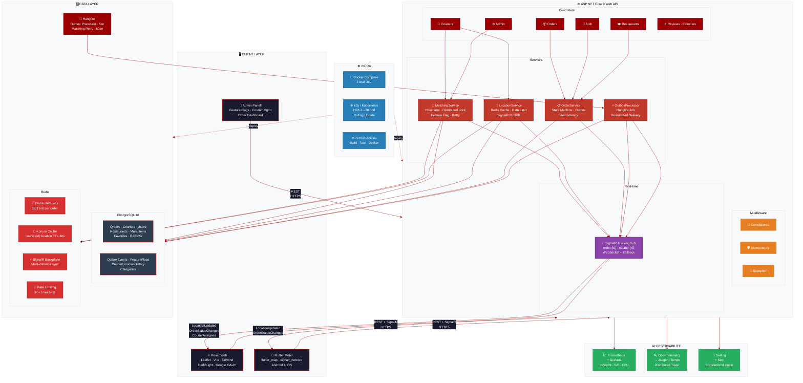
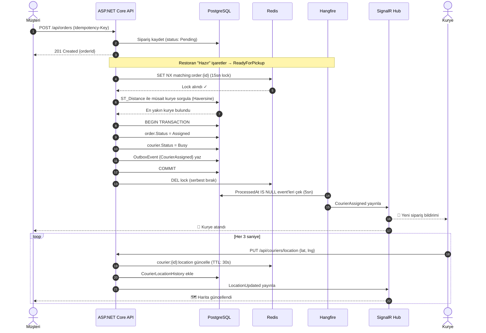
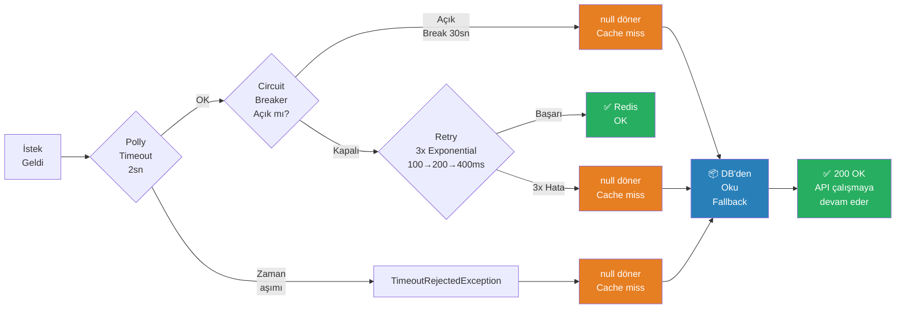
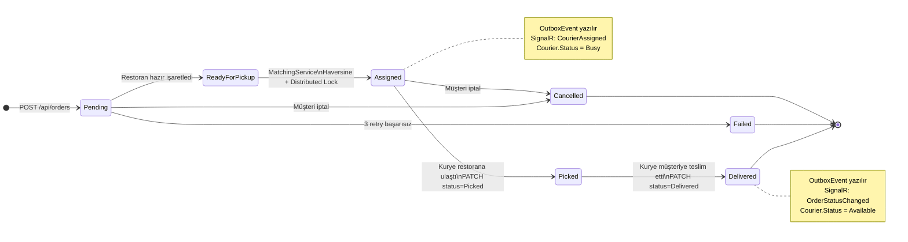
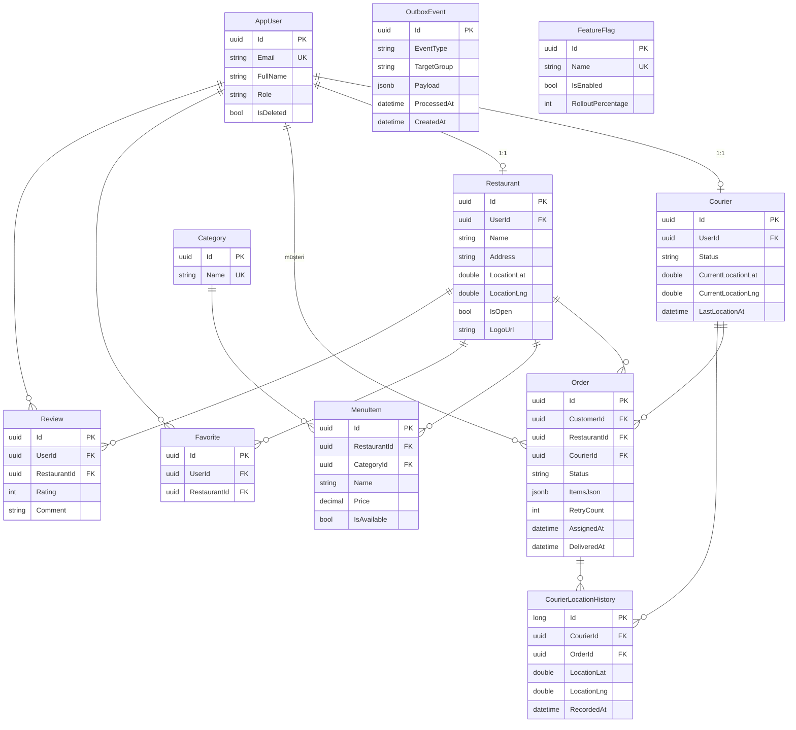

# Götür — Sistem Mimarisi

---

## Veri Akışı — Sipariş Eşleştirme

---

## Veri Akışı — Graceful Degradation (Redis Down)

---

## Durum Makinesi — Sipariş Yaşam Döngüsü

---

## Veritabanı İlişkileri

